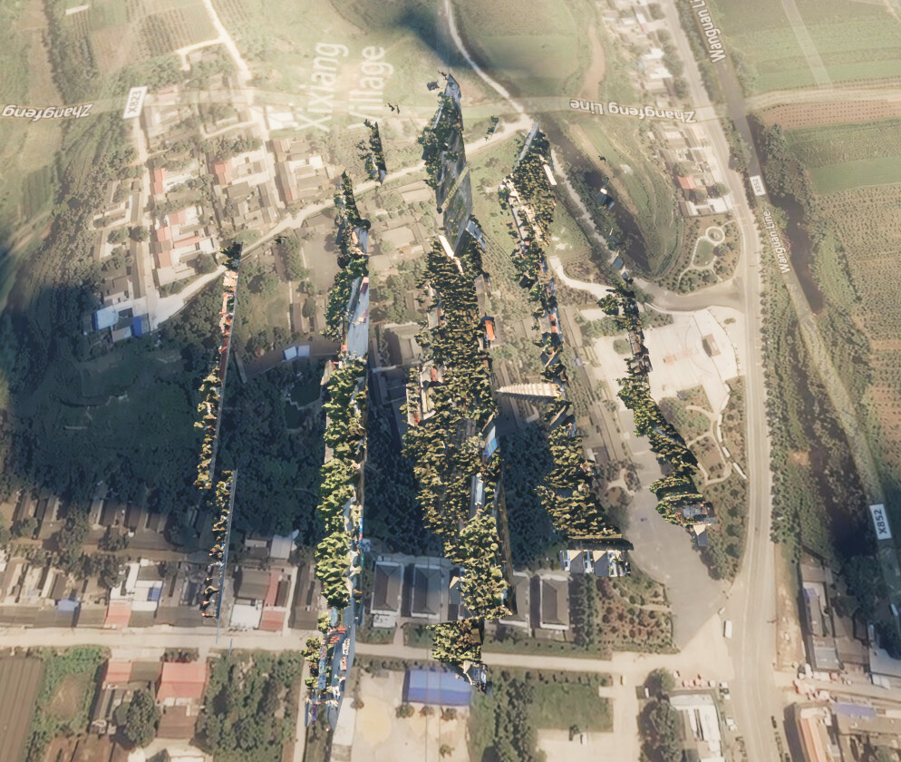
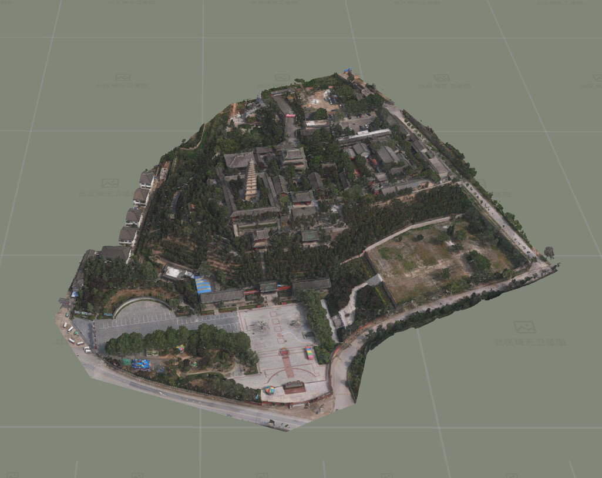
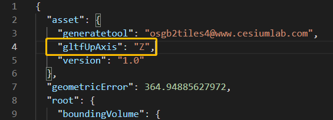
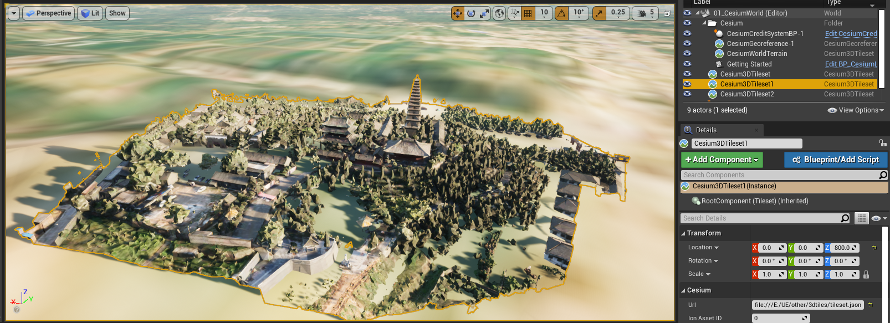

[Cesium for Unreal](https://www.unrealengine.com/marketplace/en-US/product/cesium-for-unreal)发布后，广大GIS爱好者立即积极参与了测试。这不，马上就有小伙伴发现了严重Bug：加载本地3DTiles坐标轴错乱，但是将3DTiles上传到[Cesium ion](https://cesium.com/ion)就没问题。

*坐标轴错乱*

*正常情况*
这马上就让人联想到是不是Cesium不想让我们加载本地数据，必须上传到Cesium ion才能使用。要知道Cesium ion只提供500M的免费空间，而且国内访问速度贼慢。

其实不要慌张，碰到问题应该第一时间去官方[github](https://github.com/CesiumGS/cesium-unreal)的[issues](https://github.com/CesiumGS/cesium-unreal/issues)或者[官方论坛](https://community.cesium.com/c/cesium-for-unreal/10)，看看有没有人踩坑。

果然就找到了：
[Unreal load 3dtileset not by ion looks wrong (rotation)](https://community.cesium.com/t/unreal-load-3dtileset-not-by-ion-looks-wrong-rotation/12835)

原来是因为**gltfUpAxis**现在只支持**Y**的属性值了，虽然Cesium提供了工具[3D Tiles Tools](https://github.com/CesiumGS/3d-tiles-validator/tree/2.0-tools/tools)可以修复3DTiles数据，不过这也太麻烦了。

然后顺腾摸瓜，找到了相关的issue：
[Add gltfUpAxis support](https://github.com/CesiumGS/cesium-unreal/issues/315)

还有PR：
[Add gltfUpAxis support](https://github.com/CesiumGS/cesium-unreal/pull/316)

才Merge不久，看来需要用Cesium for Unreal源码，而不能用[官方市场](https://www.unrealengine.com/marketplace/en-US/product/cesium-for-unreal)的版本了。估计您读到这篇博文时，官方版本已经更新并修复这个Bug了。

编译流程请参考[Compiling Cesium for Unreal](https://github.com/CesiumGS/cesium-unreal#hammer_and_wrench-compiling-cesium-for-unreal)

下面是修复后的效果：

最后分享笔者编译好的Cesium for Unreal插件，解压放到工程Plugins目录，或者直接替换引擎里的Cesium for Unreal插件，比如笔者的引擎插件目录：
> E:\Program Files\Epic Games\UE_4.26\Engine\Plugins\Marketplace

链接: [Cesium for Unreal插件](https://pan.baidu.com/s/1tw-K-ygo53owiNvD6xVz6Q) 提取码: ydcy

都看到这里了，加个技术交流群一起组队研究呗^^

