> 原文请参考Cesium官方文档：[Adding Photogrammetry](https://cesium.com/docs/tutorials/cesium-unreal-020-photogrammetry/)

> 上一篇：[（一）Cesium for Unreal快速入门（译）](./cesium-unreal-quickstart.html)

这篇教程讲解了如何用**Cesium for Unreal**从**Cesium ion**导入倾斜摄影模型。您将使用世界上最宜居城市之一的模型：澳大利亚墨尔本。

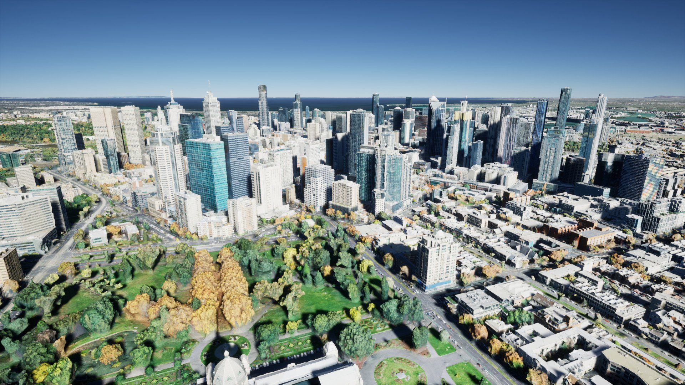
*在虚幻引擎中加载澳大利亚维多利亚州墨尔本倾斜摄影模型。数据来自[墨尔本市3D纹理网格CC BY 4.0](https://data.melbourne.vic.gov.au/Property/City-of-Melbourne-3D-Textured-Mesh-Photomesh-2018/d5tb-r7a6)*

您将学习如何：

* 从**Cesium ion**导入城市级的3D Tiles倾斜摄影模型。
* 使用**CesiumGeoreference** Actor在全球范围内对您的关卡进行经纬度定位。

## 准备工作
* 安装[虚幻引擎](https://www.unrealengine.com/zh-CN/download)（至少4.26或更高版本）和[Cesium for Unreal](https://cesium.com/unreal-marketplace)插件。
* 一个[Cesium ion](https://cesium.com/ion)账号，用于将墨尔本倾斜摄影模型流式加载到虚幻引擎中。
> 请参考[（一）Cesium for Unreal快速入门（译）](./cesium-unreal-quickstart.html)，了解如何安装**Cesium for Unreal**并将其与**Cesium ion**关联。

## 第一步：创建一个项目和关卡
请参考[（一）Cesium for Unreal快速入门（译）](./cesium-unreal-quickstart.html)，只需要操作到第五步《连接到Cesium ion》就行了，这里要把白膜模型替换成倾斜摄影建筑模型。

## 第二步：从**Cesium ion**添加墨尔本倾斜摄影模型
1. 通过单击工具栏中的图标来打开**Cesium**面板。
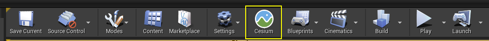

2. 如果还没有连接到Cesium ion，请点击**Connect**按钮连接。
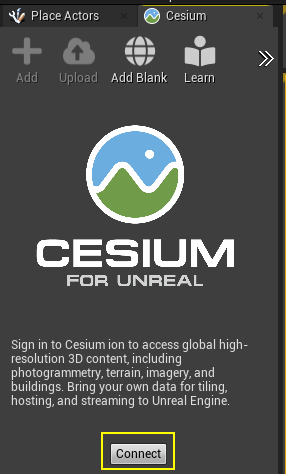

3. 单击**Add**按钮，打开**Cesium ion Assets**面板。
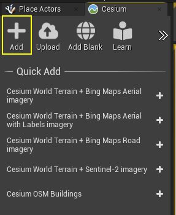

4. 在资产列表中找到并选中**Melbourne Photogrammetry**，然后点击**Add to Level**添加**Melbourne Photogrammetry**倾斜摄影模型到当前关卡。
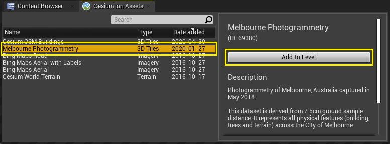

> 如果资产列表中找不到**Melbourne Photogrammetry**，请访问[墨尔本倾斜摄影资产仓库](https://cesium.com/ion/assetdepot/69380)页面，然后单击**Add to my assets**，添加到我的资产列表。然后返回虚幻引擎，关闭**Cesium ion Assets**面板，然后再次单击**Cesium**面板上的**Add**按钮，以重新打开并刷新资产列表。

5. 在**世界大纲视图**面板中双击**Melbourne Photogrammetry**墨尔本倾斜摄影Actor，将编辑器视角跳转到**墨尔本**。
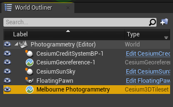

你可能会发现上下颠倒了，刚添加的墨尔本倾斜摄影模型飘在头顶了。没关系，下一步就会修复这个问题。
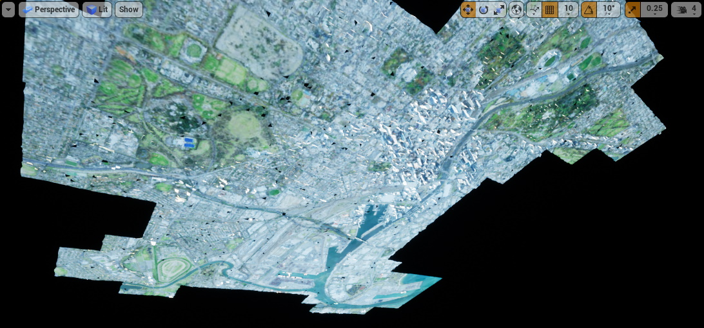

## 第三步：让墨尔本在虚幻引擎的世界中居中显示
屏幕上墨尔本的方向很奇怪，是因为虚幻编辑器里相机的+Z方向始终是朝上的。与大多数游戏不同，在地球上，以地球为中心的坐标系中的**向上**方向会根据您在地球上的位置而变化（译者注：倾斜摄影模型本身有经纬度信息，当你把倾斜摄影模型添加到关卡后，Cesium for Unreal会自动调整倾斜摄影模型的位置和旋转，让他贴着地球表面；当你从地球的某个地方移动到墨尔本时，镜头的位置变了，但是向上的方向还是以前的，如果你从美国移动到中国，你会发现上下颠倒了）。

执行下面的步骤，让虚幻引擎的世界坐标重新定位：

1. **世界大纲视图**面板中点击**CesiumGeoreference-1**。
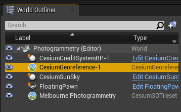

2. 在**细节**面板中，单击**Place Georeference Origin Here**按钮。
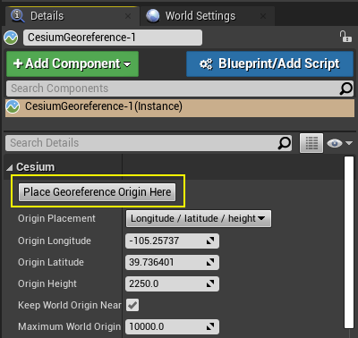

然后墨尔本就显示正常了。如果场景变黑，可能是因为现在的时间是墨尔本的夜间。调整调整**CesiumSunSky**对象上的**Solar Time**属性。
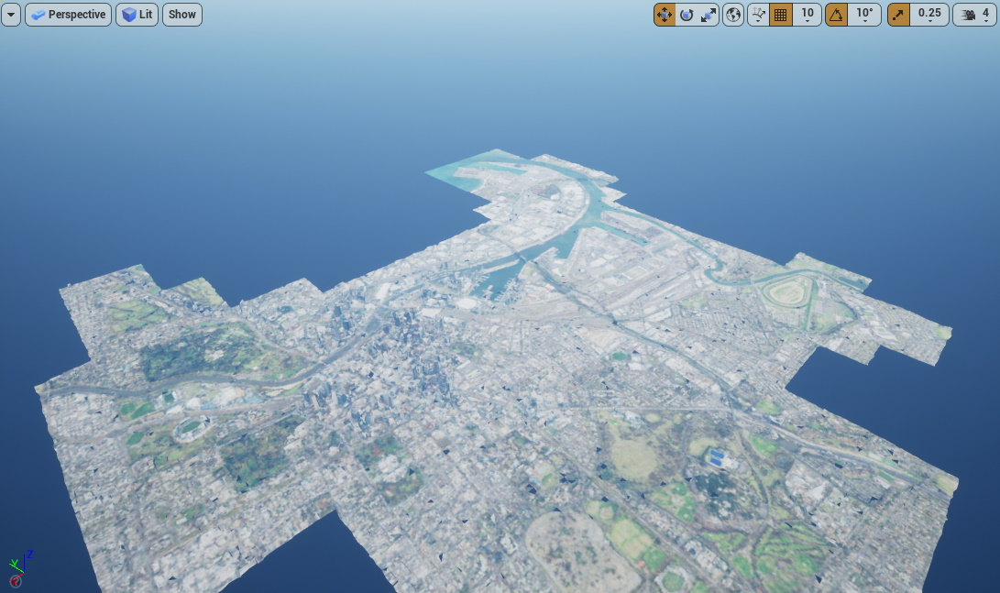

**Place Georeference Origin Here**按钮不仅改变了方向。如果仔细观察，您可能会注意到按下按钮时按钮下方的经度、纬度和高度属性也发生了变化。确切地说，该按钮重新定位了虚幻引擎关卡的坐标系，以使其中心点(0, 0, 0)恰好位于相机的位置。并且对齐了虚幻引擎的坐标轴，使+X指向东方，+Y指向南方，+Z指向上方。

您也可以直接输入**经度Longitude**，**纬度Latitude**和**高度Height**值，在地球上精准定位。

将世界坐标原点定位在某个地方可能非常有用。因为虚幻引擎中的许多东西（相机、植被和物理特性）都应该设置为相对较小的值，且+Z朝上。通过以这种方式**经纬度映射georeferencing**到虚幻的世界坐标系，我们就可以将普通的虚幻引擎对象放置在墨尔本及其周围，并且像在其他任何游戏中一样对他们进行操作。

## 第四步：添加地球背景
这时候，墨尔本悬在一片黑暗之海中。让我们来添加地球背景：

1. 在**Connect**面板中，单击**Cesium World Terrain + Bing Maps Aerial imagery**右侧的加号（可以随意添加其他Cesium World Terrain + imagery组合之一）。
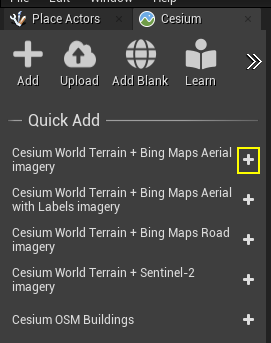

墨尔本周围的区域将填充刚添加的地球背景：
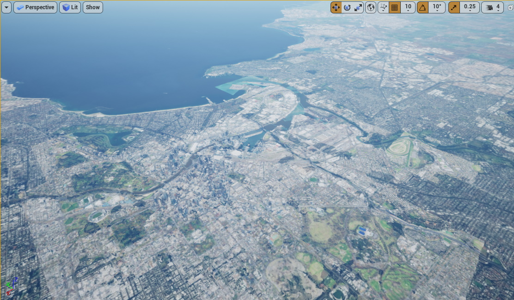

从远处看起来还不错，但是当我们我们把镜头拉近时，就会发现倾斜摄影模型和Cesium世界地形交错重叠了。有的地方倾斜摄影模型在Cesium世界地形的上面；有的地方倾斜摄影模型在Cesium世界地形的下面：
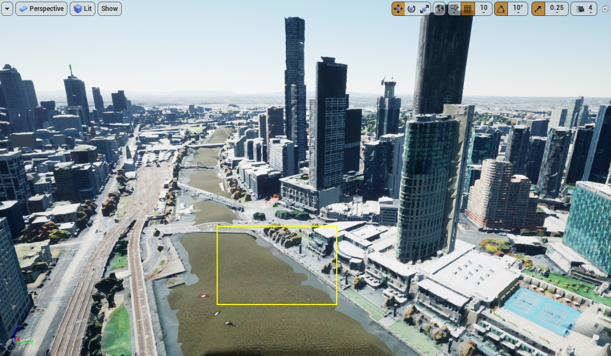

发生这种情况是因为Cesium世界地形和墨尔本倾斜摄影都是高分辨率数据集，并且可能与相同的地理区域重叠。将来的Cesium for Unreal版本将允许您**切掉**Cesium世界地形，以便为倾斜摄影模型腾出空间。在没有这个功能之前，我们先向上移动倾斜摄影模型，以使地形模型不再遮挡倾斜摄影模型。

2. 选中墨尔本倾斜摄影模型**Melbourne Photogrammetry** Actor，然后通过在Z坐标框内单击并向右拖动或者输入数字来调整Z坐标值。

下一步
继续阅读《使用自定义控制器》教程（敬请期待），在该教程中，您将学习如何在关卡中添加有物理特性（重力感应）的控制器，并使用它来探索倾斜摄影模型。

都看到这里了，加个技术交流群一起组队研究呗^^

