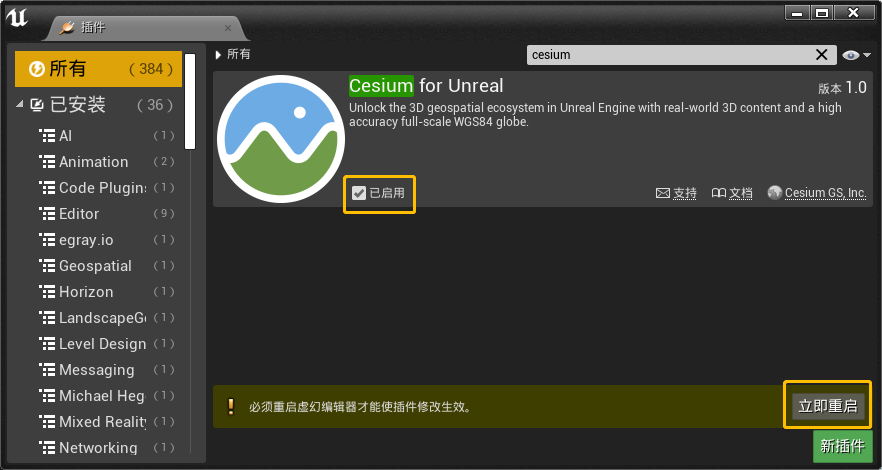

> 原文请参考Cesium官方文档：[Cesium for Unreal Quickstart](https://cesium.com/docs/tutorials/cesium-unreal-quickstart/)

<iframe src="//player.bilibili.com/player.html?aid=205068818&bvid=BV16h411U7i6&cid=323264285&page=1" width="800" height="450" scrolling="no" border="0" frameborder="no" framespacing="0" allowfullscreen="true"> </iframe>

> 译者注：如果您做过Web前端可视化、WebGL、GIS相关的开发工作，您肯定听说过[Cesium](https://cesium.com/)。

> Cesium是一个开源的三维GIS平台，用卫星地图、地形、建筑白膜、倾斜摄影、点云等数据还原真实的三维地球。

> 2020-05-28日，虚幻官方论坛发过[From Ants to Outer Space](https://forums.unrealengine.com/t/inside-unreal-from-ants-to-outer-space-may-28/144011)的文章，作者用非常tricky的方式模拟了从地面上的一个小蚂蚁飞到外太空看地球的场景。

> 早期Cesium提供了Javascript语言的CesiumJS框架，如今Cesium for Unreal于2021-03-30正式发布，让虚幻引擎具有了[Google Earth](https://baike.baidu.com/item/%E8%B0%B7%E6%AD%8C%E5%9C%B0%E7%90%83)的能力，为模拟真实世界打开了一扇新的大门。

这是一份关于用Cesium World Terrain和Cesium OSM Buildings创建Cesium for Unreal应用的快速入门教程。（译者注：需要您具有基本的虚幻引擎使用技能，懂一点C++更好。关于虚幻引擎的基本技能，请参考官方[在线学习教程](https://www.unrealengine.com/zh-CN/onlinelearning-courses)）：
* [初识虚幻引擎](https://www.unrealengine.com/zh-CN/onlinelearning-courses/your-first-hour-with-unreal-engine)
* [虚幻引擎入门](https://www.unrealengine.com/zh-CN/onlinelearning-courses/introducing-unreal-engine)
* [理解项目和文件结构](https://www.unrealengine.com/zh-CN/onlinelearning-courses/comprehending-projects-and-file-structure)
* [虚幻引擎编辑器基础——编辑器入门](https://www.unrealengine.com/zh-CN/onlinelearning-courses/unreal-editor-fundamentals---editor-introduction)
* [蓝图：基础概念](https://www.unrealengine.com/zh-CN/onlinelearning-courses/blueprints---essential-concepts)
* [虚幻编辑器基础——材质](https://www.unrealengine.com/zh-CN/onlinelearning-courses/unreal-editor-fundamentals---materials)
* [材质：基础概念](https://www.unrealengine.com/zh-CN/onlinelearning-courses/materials---exploring-essential-concepts)
* [了解可视化设计中的材质](https://www.unrealengine.com/zh-CN/onlinelearning-courses/getting-to-know-materials-for-design-visualization)
* [将蓝图转换为C++](https://www.unrealengine.com/zh-CN/onlinelearning-courses/converting-blueprints-to-c)

*用Cesium World Terrain和Cesium OSM Buildings创建的韩国首尔在虚幻引擎中的场景*

您将学会如何：

* 在虚幻引擎中安装Cesium for Unreal插件
* 添加一个关卡并且从Cesium ion导入资产
* 在Cesium for Unreal应用中添加照片级的光照效果

## 准备工作
* 安装虚幻引擎（至少需要4.26或以上版本）。关于如何安装虚幻引擎，请访问虚幻引擎[下载页面](https://www.unrealengine.com/zh-CN/download)。
* 一个Cesium ion帐号，用于将地形和建筑物资产流式传输到虚幻引擎中。如果您还没有免费的Cesium ion帐号，请[注册](https://cesium.com/ion)一个。
> Cesium ion是一个用于流式传输和托管3D内容的开放平台，并且包含全球的、精准的GIS数据，可用于创建展示真实三维地球的应用程序。

## 第一步：安装Cesium for Unreal插件
如果尚未安装，请先安装Cesium for Unreal插件。

1. 在虚幻引擎市场上打开[Cesium for Unreal](https://cesium.com/unreal-marketplace)插件页面。

2. 登录虚幻引擎商城，并单击**免费**按钮，将插件安装在虚幻引擎中。

## 第二步：创建项目和关卡
1. 启动虚幻引擎，并创建一个新项目。在**选择游戏模板**界面选择**游戏**。

点击**下一步**，在**选择模板**界面选择**空白**。其他模板类型也可以。

在**项目设置**中选择**不带初学者内容包**，以避免不必要的内容使关卡混乱。选择新项目路径，修改项目名称后，点击**创建项目**。

2. 激活Cesium for Unreal插件。打开菜单**编辑**->**插件**，然后在**插件**窗口右上角的搜索栏中搜索**cesium**。确保Cesium for Unreal插件的**已启用**复选框已勾选。启用插件后，重新启动虚幻引擎。

3. 打开菜单**文件**->**新建关卡**，选择**关卡**。

4. 打开菜单**文件**->**保存当前关卡**，选择存储路径，将新关卡命名为QuickStart。（译者注：关于命名规则，请参考[UE4 Style Guide](https://github.com/Allar/ue4-style-guide)）

5. 打开菜单**编辑**->**项目设置**，再选择**项目**->**地图和模式**。将**编辑器开始地图**和**游戏默认地图**设置为刚创建的关卡QuickStart。这样可以确保在重新启动虚幻编辑器时自动重新打开您的关卡。

## 第三步：添加SunSky照明和FloatingPawn
CesiumSunSky蓝图给室外场景增加了炫酷的天阳光照明，它扩展了内置的SunSky蓝图，让它跟真实地球上的太阳光一模一样。同样，Cesium的FloatingPawn扩展了内置的FloatingPawn，使其能在地球上任意移动，并允许使用鼠标滚轮控制移动速度，特别是距离地面很远时非常有用（用键盘WSAD前后左右移动，鼠标控制方向，滚轮控制移动速度）。

> 当视角在Cesium地球上方的不同位置之间飞行时，照相机应遵循与地球表面平行的弯曲路径，而不是线性的点对点飞行轨迹。Cesium的FloatingPawn就是做这个用的，它确保你从地球的一边飞到地球的另外一边时，向上的方向始终从地球的球心指向天空（直观的理解就是：因为地球是园的，不是平的，所以虚幻引擎默认的相机移动方式就不行了）。

1. 打开菜单**编辑**->**项目设置**，然后搜索**luminance**（或者参考下图）。确保启用了**扩展自动曝光设置中的默认亮度范围**选项。如果未启用此选项，则在阳光直射的情况下，用SunSky照明会完全曝光，界面白茫茫一片。启用此选项后，需要重新启动虚幻引擎。

2. 单击**内容浏览器**右下角的**视图选项**，并确保同时勾选了**显示引擎内容**和**显示插件内容**。

3. 在**内容浏览器**中，单击**选择路径**按钮，搜索**Cesium**，或者向下滚动以查找并单击**CesiumForUnreal内容**。

4. 将CesiumSunSky和FloatingPawn蓝图拖动到关卡视口中。

## 第四步：在关卡开始时自动拥有FloatingPawn
在上面的步骤中，您将FloatingPawn添加到了关卡中，但是玩家还不能控制它，还需要执行下列步骤才能使用它在世界各地移动。

1. 在**世界大纲视图**中选择**FloatingPawn**。
2. 设置游戏开始时，玩家0自动控制**FloatingPawn**：在**细节**面板中，搜索**possess**，点击**自动控制玩家**旁边的下拉菜单，然后选择**玩家0**。

## 第五步：连接到Cesium ion
1. 通过单击工具栏中的Cesium图标来打开Cesium面板。

该Cesium面板将显示在编辑器窗口的左侧。

2. 点击**Connect**按钮，连接到Cesium ion。这时浏览器会自动打开，要求您允许Cesium for Unreal使用Cesium ion中当前登录的帐户访问您的资产：

选择**Allow**并返回虚幻引擎以继续下一步。

## 第六步：创建一个地球
在此步骤中，您将使用Cesium ion的资产填充场景。

1. 通过单击工具栏中的Cesium按钮来打开Cesium面板。在**Quick Add**中，单击**Cesium World Terrain + Bing Maps Aerial imagery**右侧的加号（可以随意添加其他Cesium World Terrain + imagery组合之一）。

此步骤将在**世界大纲视图**中生成新的**Cesium World Terrain**和**CesiumGeoreference**蓝图对象。

2. 地平线附近可能会有一条黑条。要解决此问题，请选择**CesiumGeoreference**对象，在**细节**面板中找到**Sun Sky**，然后使用刚创建的**CesiumSunSky**对象对其进行初始化。

> 一旦将**CesiumSunSky**对象连接到**CesiumGeoreference**对象，便会自动修改其纬度和经度属性，以使地球和太阳保持同步。

3. 如果场景太暗，请调整**CesiumSunSky**对象上的**Solar Time**属性，比如设置一个美丽的日落场景。您可能还想更改**时区Time Zone**。

有关这些属性如何工作的更多信息，请访问虚幻引擎文档站点上的[SunSky](https://docs.unrealengine.com/zh-CN/BuildingWorlds/LightingAndShadows/SunSky/index.html)对象文档。

## 第七步：将全球三维白膜建筑（OSM Buildings）添加到场景中
在此步骤中，您将在**Cesium World Terrain**上面添加Cesium OSM Buildings。与步骤六相似，您将使用编辑器中的Cesium面板添加新资产。

1. 导航回到虚幻引擎中的Cesium面板。您将使用**Cesium ion Assets**窗口来添加**Cesium OSM Buildings** ，而不是像上一步那样使用**Quick Add**窗口。单击左上角的**Add**按钮以切换到**Cesium ion Assets**窗口（此窗口默认在左下方，在**内容浏览器**页签右边）。在这里，您将看到**Cesium ion**帐户中存在的所有资产。

2. 选择**Cesium OSM Buildings**，然后单击**Add Add to Level**。

然后您将看到**Cesium OSM Buildings**现在已添加到**世界大纲视图**中。

> 如果**Cesium ion Assets**中没有**Cesium OSM Buildings**，请访问[Cesium OSM Buildings](https://cesium.com/ion/assetdepot/96188)资产仓库页面，然后单击**Add**按钮添加到我的资产。然后返回虚幻引擎，关闭**Cesium ion Assets**面板，然后再次单击**Cesium**面板上的**Add**按钮以重新打开并刷新资产列表。

3. 如果您看不到建筑物，那么您可能在地球上没有建筑物的地方。要导航到地球的某个地方，请在**世界大纲视图**中选择**CesiumGeoreference**对象，在**细节**面板中，在**Cesium**类别下找到原点经度**Origin Longitude**，原点维度**Origin Latitude**和原点高度**Origin Height**属性。

将这些属性调整为您想要的值。例如，以下建筑物位于美国伊利诺伊州芝加哥市，经度-87.629799，纬度41.878101，高度2250.0。

设置**CesiumGeoreference**原点后，编辑器相机将立即跳转到那里。但是，尽管原点发生了变化，但**FloatingPawn**会进行自我调整，以保持其在地球上的先前位置。当你点击**运行**按钮时，如果您想在芝加哥开始，在**世界大纲视图**中选中**FloatingPawn**，设置其位置为（0，0，0）。

4. 点击工具栏**运行**按钮，然后使用键盘W，A，S和D键以及鼠标在地球上漫游！用鼠标滚轮可以控制飞行速度。当相机离地面近时，往下滚动鼠标滚轮降低飞行速度；当相机离地面远时，向上滚动鼠标滚轮增加飞行速度。在编辑器中，还可以用右上角的控件修改相机移动速度。

## 下一步
现在，您可以添加更多资产并自定义场景了！继续添加倾斜摄影资产（敬请期待）。

都看到这里了，加个技术交流群一起组队研究呗^^

